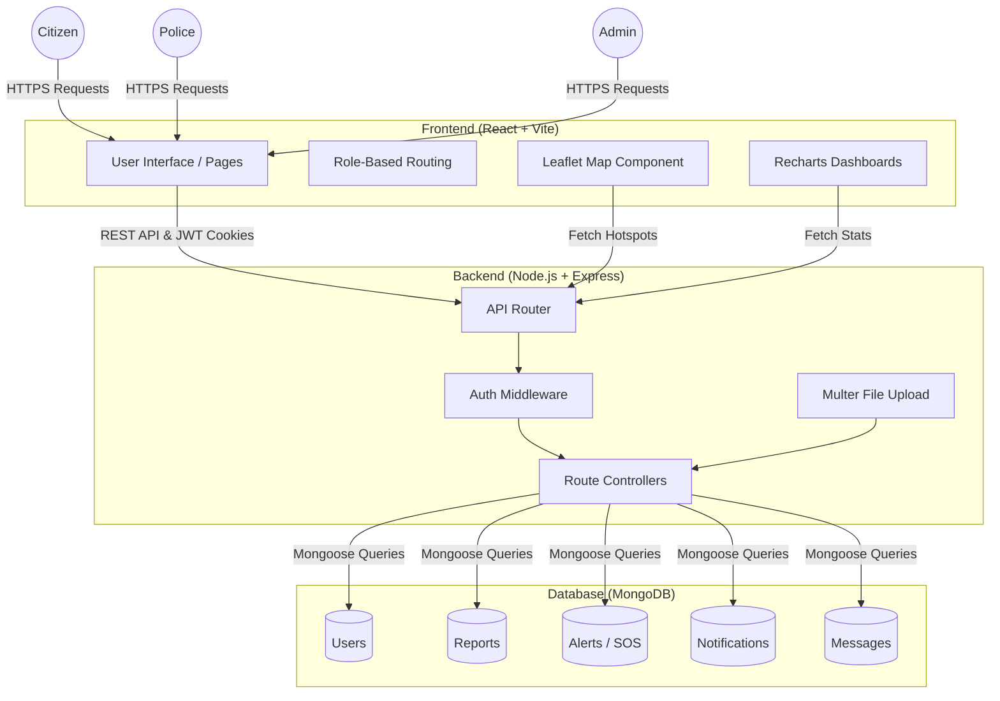
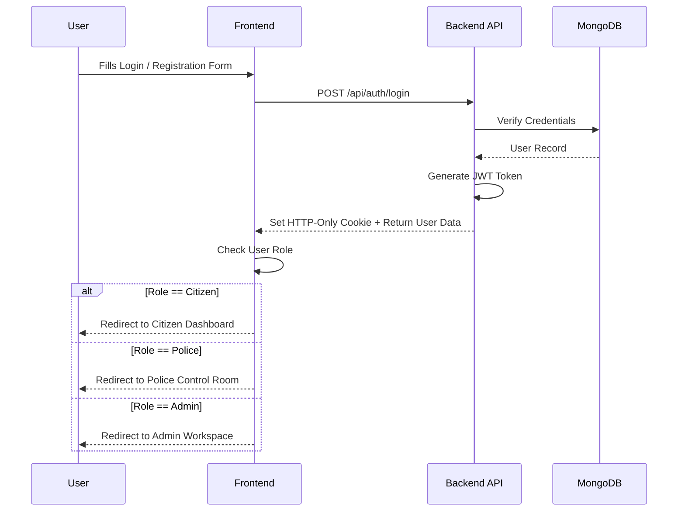
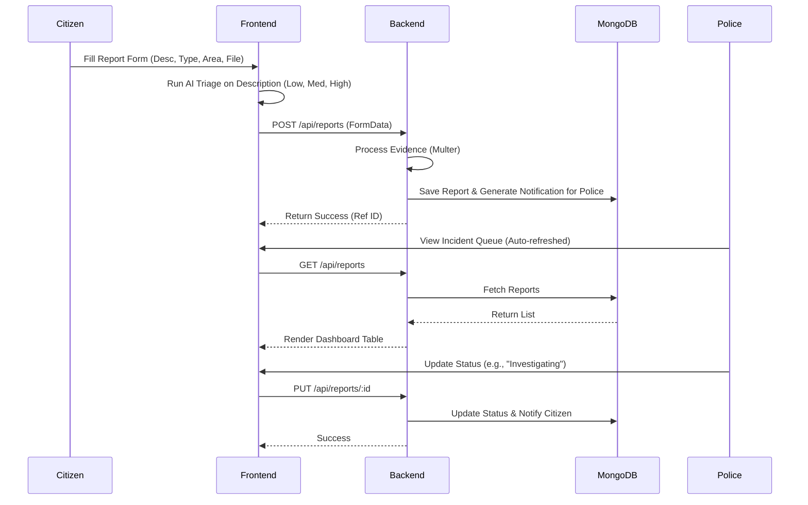
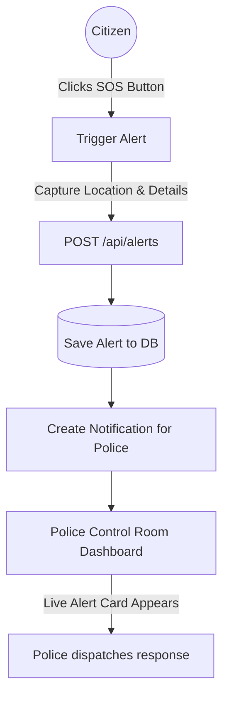
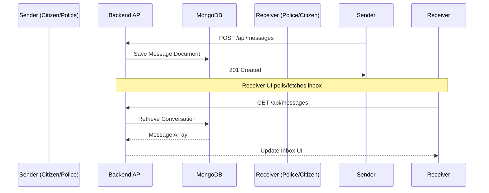

# Crime Reporting System Architecture & Workflow

This document outlines the high-level architecture and key operational workflows for the **SafetyFirst - Crime Reporting & Public Safety Platform**.

## 1. System Architecture

The application follows a standard MERN (MongoDB, Express.js, React.js, Node.js) stack architecture. 

- **Frontend (Client-Side):** Built with React 19 and Vite. Uses React Router for Role-Based Access Control (RBAC) navigation. Employs `React Leaflet` for geospatial maps and `Recharts` for analytics.
- **Backend (Server-Side):** Powered by Express.js and Node.js. It exposes a RESTful API and utilizes middleware for authentication (JWT via HTTP-only cookies) and file uploads (Multer).
- **Database:** MongoDB via Mongoose ODM. It persists entities like Users, Reports, Alerts (SOS), Notifications, and Messages.

---

## 2. Core Workflows

### A. Authentication & Access Control Workflow

The system directs users to distinct operational dashboards based on their role: Citizen, Police, or Admin.

### B. Incident Reporting & Triage Workflow

When a citizen reports a crime, the frontend automatically categorizes the priority based on keywords (AI triage) and submits the report. Responders process it and updates are visible to the citizen.

### C. Emergency SOS Alert Workflow

Citizens can trigger a one-tap SOS that dispatches an alert immediately to the Police Dashboard.

### D. Direct Messaging Workflow

A built-in chat mechanism allows Citizens and Police officers to exchange messages without leaving the platform.

